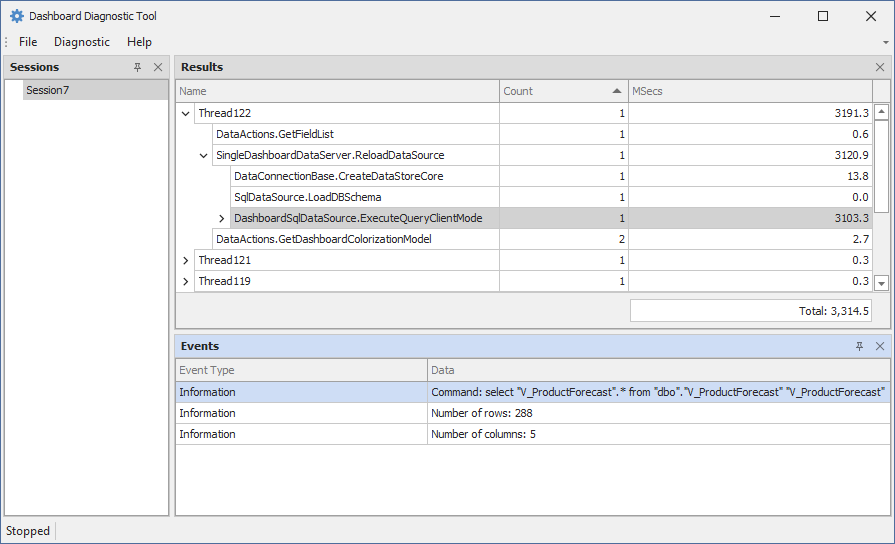
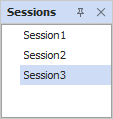
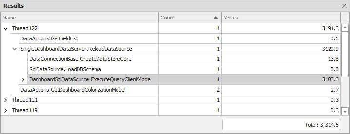
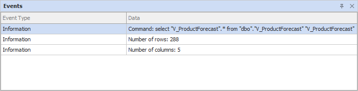
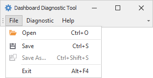
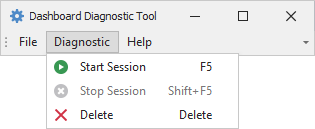

# The Dashboard Diagnostic Tool UI

The Diagnostic Tool contains a user interface to display and analyze your session data:  

The sections below describe main parts of the Dashboard Diagnostic Tool interface.

## Sessions

The **Sessions** window shows created sessions and allows you to navigate between them. 

A **session** contains all actions executed in a specific time period. When you start a session, the Dashboard Diagnostic Tool monitors the executed code and collects actions for each session event. After you stop the session, the Dashboard Diagnostic Tool generates a log tree. You can inspect logs in the UI or save the resulting report in XML format.

## Results 

The **Results** window displays resulting benchmarks.

**Benchmarks** are used to measure and compare performance. Each benchmark contains the following information:

- **Name**

  The benchmark name.
        
- **Count**

  The number of code calls.
          
- **MSecs**

  The code block's execution time in milliseconds.

The image below displays a log tree for a dashboard load operation. The most time-consuming task of this session is the query execution.
     

## Events

The **Events** window displays information about the objects collected since the trace event started.

The image below shows logs for the `DashboardSqldataSource.ExecuteQueryClientMode` benchmark. These logs obtain the executed query and the number of requested columns and rows. 

## Manage Sessions in the UI

The main menu contains the following commands:

- **File**

    

    The File menu allows you to save session data in an XML report. Click **Open** to load an existing report. Select **Exit** to close the program.

- **Diagnostic** 

    

    The **Diagnostic** menu allows you to manage sessions. Click **Start Session** to create a new session. **Stop Session** ends the session and generates a log tree. Click **Delete** to delete the selected session.
