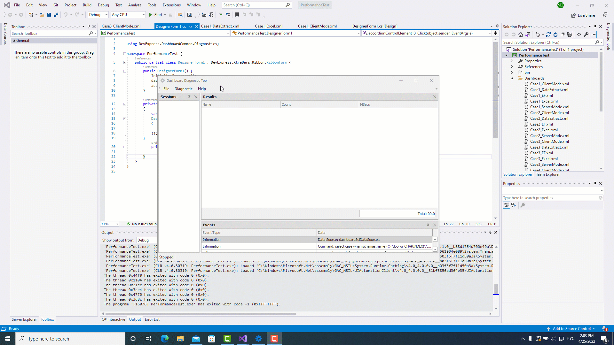

<!-- default badges list -->

[](https://supportcenter.devexpress.com/ticket/details/T1085109)
[](https://docs.devexpress.com/GeneralInformation/403183)
<!-- default badges end -->
# BI Dashboard Diagnostic Tool

The BI Dashboard Diagnostic Tool is the performance monitoring system that allows you to inspect the specific activity during the code execution of main DevExpress BI Dashboard's data processing areas. For example, you can estimate the time of executed operations or see the number of code calls for the session period. 

## Example Overview

The BI Dashboard Diagnostic Tool consists of two projects:

- [DashboardDiagnosticToolUI](./DashboardDiagnosticToolUI) 

  The main project that contains a user interface to display and analyze your session data.

  Read more: [The Dashboard Diagnostic Tool UI](./DashboardDiagnosticToolUI/readme.md)

- [DiagnosticTool](./DiagnosticTool) 

  Contains the source code of the BI Dashboard Diagnostic Tool.

## Prerequisites

Specify your DevExpress NuGet feed autorization key in [nuget.config](./nuget.config#L7).

## Use Diagnostic Tool in the UI

1. Run the Diagnostic Tool.

2. Select **Start Session**.

3. Run the code you want to diagnose.

4. Click **Stop Session** after the code complied. Wait for the log tree to be built.

5. Save the report.

You can analyze the resulting report or send it to [Support Centre](https://supportcenter.devexpress.com/ticket/list) for help.

The following GIF image illustrates how to use the Diagnostic Tool to examine the performance of the dashboard load operation:



## Use Diagnostic Tool in Code

### Windows

1. Reference `DiagnosticTool.dll` and install the [Microsoft.Diagnostics.Tracing.TraceEvent](https://www.nuget.org/packages/Microsoft.Diagnostics.Tracing.TraceEvent/) package in your dashboard project. 

2. Create a custom button and insert it to the Ribbon.

3. Create a `DiagnosticController` object. 

4. Call the conroller's Start() and Stop() methods on button's click to run and finish the Dashboard Diagnostic Tool's session.

5. Implement the `IFileController` interface and specify the output file path in the `TrySaveFile` method. Pass a new class instance that implements `IFileController` to the controller's contructor. 

6. To save the resulting report to the specified output path, call the controller's `Save()` method.

### Linux

1. Write in the console:

   ``` Bash
        sudo apt-add-repository main
   ```

   ``` Bash
        sudo apt-add-repository ppa:lttng/ppa
        sudo apt-get update
        sudo apt-get install lttng-tools lttng-modules-dkms babeltrace2
   ```

   ``` Bash
        export COMPlus_PerfMapEnabled=1
        export COMPlus_EnableEventLog=1
   ```

3. Run the code you want to diagnose.

## Documentation


## Examples 

[Dashboard for WinForms - Inspect the Dashboard Performance](https://github.com/DevExpress-Examples/dashboard-for-winforms-diagnose-performance)
